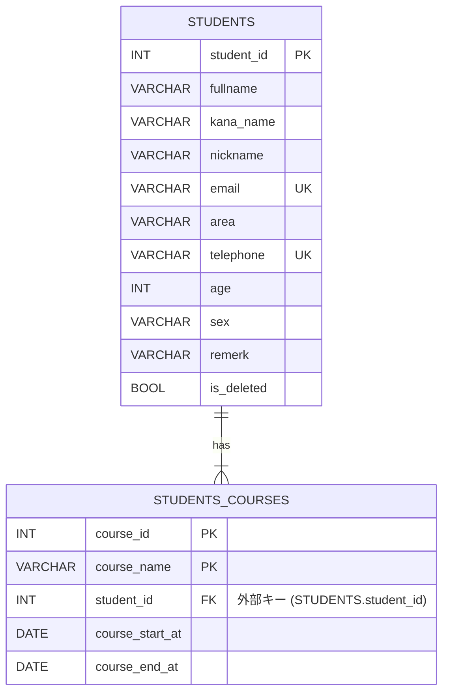
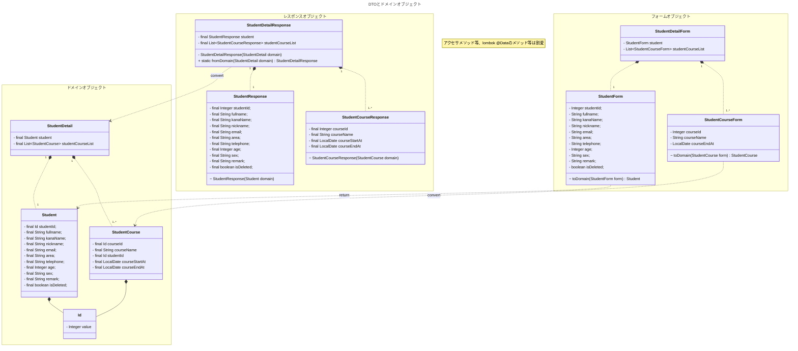
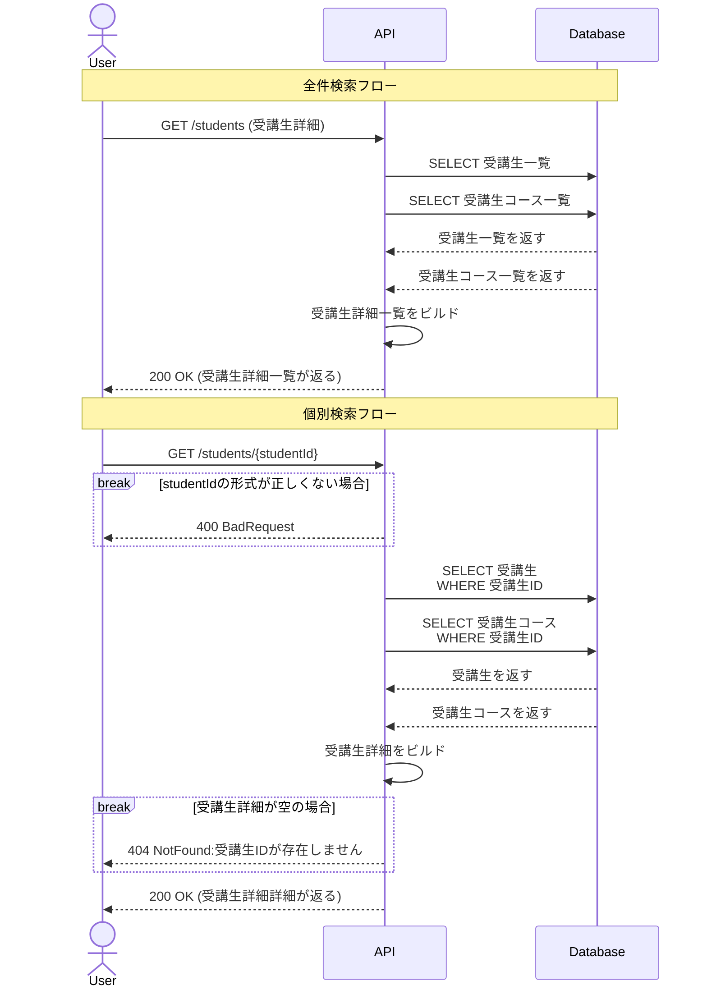
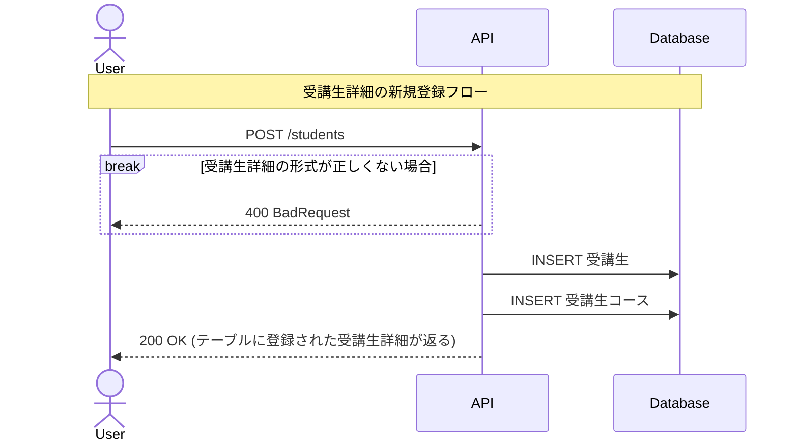
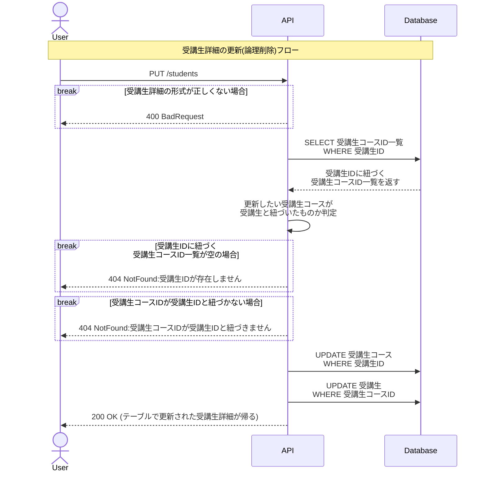
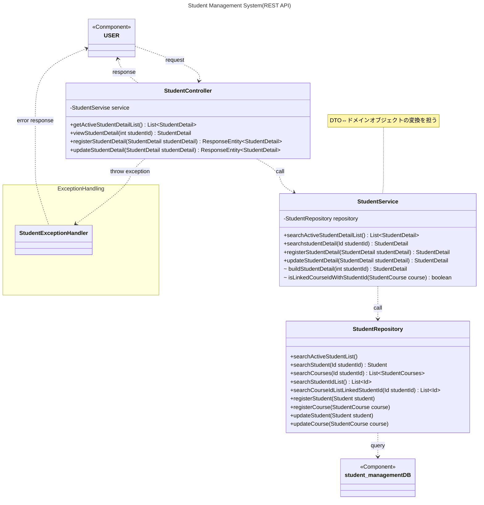
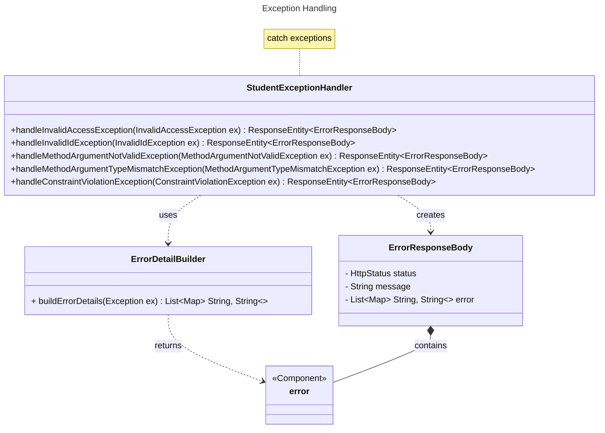

# StudentManagement

## 概要

***
所属しているプログラミングスクール(RaiseTech)の課題として作成しております。

架空のプログラミングスクールの受講生の運営スタッフがプロフィールと受講コース情報を管理するためのAPIです。

このAPIは、以下の処理が可能です。

+ 受講生詳細の全件検索
+ 受講生詳細の個別検索（受講生ID指定）
+ 受講生詳細の新規登録
+ 受講生詳細の更新（論理削除を含む）

### 【GitHub】

https://github.com/masayoshi6/StudentManagement

詳細なAPI仕様は、以下のリンクからご確認できます。

[API仕様書.pdf](../../Desktop/API%E4%BB%95%E6%A7%98%E6%9B%B8.pdf)

## 詳細

---

### 開発環境

**使用技術**  

**使用ツール**  

---

### E-R図(データモデル) Entity-Relation Diagram

受講生と受講生コースは1対多の関係を持ちます。受講生と、その受講生のすべてのコースの情報で受講生詳細(
studentDetail)を組み立てます。

---

### データ転送オブジェクト　Data Transfer Object

#### 背景

将来的な機能拡張を想定し、受講生ID(`studentId`)、受講生コースID(`courseId`)のため、バリューオブジェクト
`Id`を設けました。
現在はシンプルな整数値をIDとして設定していますが、UUIDやコース名のイニシャルを含む連番等への変更を検討しています。

この際、クライアントと安全に値を受け渡すことができるよう、フォームオブジェクトとレスポンスオブジェクトを設けました。

#### 役割

- フォームオブジェクトとレスポンスオブジェクトは、
  それぞれ自分自身のクラスにおいて、ドメインオブジェクトに変換するためのメソッド(`toDomain`,
  `fromDomain`)を持ちます。
- `toDomain`メソッド, `fromDomain`メソッドによって、`studentId`, `courseId`は`Integer`型から`Id`
  型へ、あるいはその反対方向に変換されます。

#### 補足

- StudentCourseのstudentIdは、バッグエンド側でStudentのstudentIdから取得して設定するため、フォームオブジェクトではフィールドを持ちません。
- StudentCourseのcourseStartAtとcourseEndAtは、バッグエンド側で登録処理実行日とその6か月後の日付を取得して設定します。
    - courseStartAtは不変のため、常にクライアントから受け取らず、フォームオブジェクトはフィールドを持ちません。
    - ただし、courseEndAtは受講期間延長を想定して、更新処理時には値を受け取ることがあるため、フォームオブジェクト自体はフィールドを持ちます。
    - クライアントが値を確認できるよう、レスポンスオブジェクトはcourseStartAtとcourseEndAtのどちらのフィールドも持ちます。

---

### シーケンス図 Sequence Diagram

---

### クラス図 Class Diagram

概観

例外処理

---

## テスト

JUnitを用いて単体テストを実装しました。

#### テストを行ったクラス

- StudentController
- StudentService
- StudentRepository
- Id
    - equals, hashCode, toStringメソッドのテスト
    - コンストラクタのテスト
    - バリデーションのテスト
- StudentDetailForm：バリデーションのテスト
- StudentForm：toDomainメソッドのテスト
- StudentCourseForm：toDomainメソッドのテスト
- StudentDetailResponse：fromDomainメソッドのテスト

## 力を入れたところ

### DTO（Data Transfer Object）設計の導入による責務の分離

- クライアントから受け取る入力（フォーム）と、レスポンスとして返す出力を明確に分離するため、DTOを導入しました。

- これにより、サービス層以降では不完全なドメインオブジェクトが扱われることがなくなり、ビジネスロジックの安全性が向上しました。

## 今後の課題

- 受講生ID以外による検索機能の実装
    - 受講生コースに受講ステータス項目（申し込み中、受講中、受講終了 等）を追加し、ステータスごとのリストを取得できるようにする
    - フルネーム、ニックネーム等のフィールドに対する完全一致・部分一致検索を可能にする

- GitHub Actionsを用いたテストの自動化
- 認証認可機能の追加