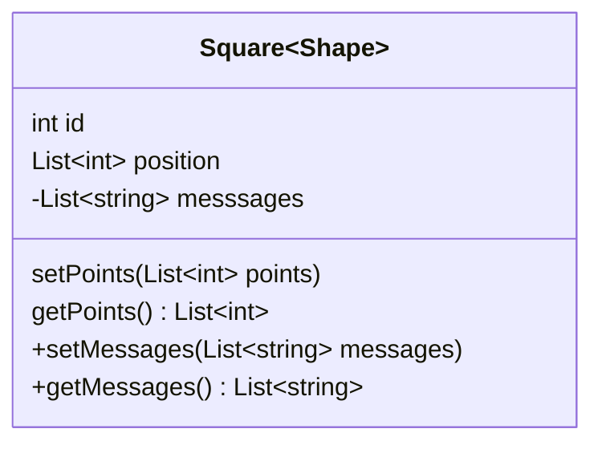

```mermaid
classDiagram
    class Square~Shape~ {
        int id
        List~int~ position
        setPoints(List~int~ points)
        getPoints() List~int~
    }

    Square: -List~string~ messsages
    Square: +setMessages(List~string~ messages)
    Square: +getMessages() List~string~
```
